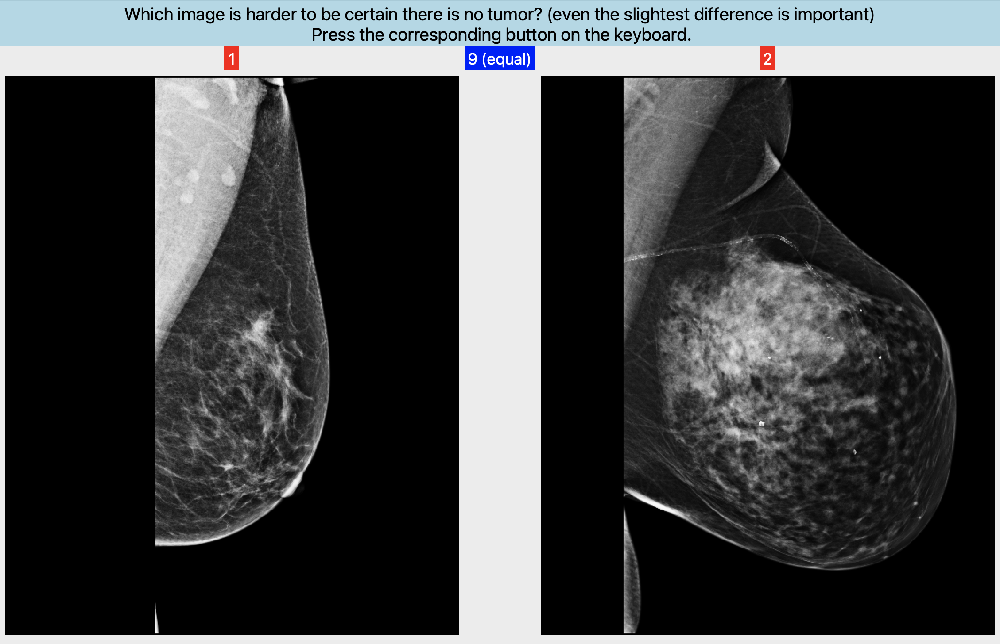

# CSAW-M_Annotation_Tool
This is the repo for the annotation tool developed to annotate [_CSAW-M: An Ordinal Classification Dataset for Benchmarking Mammographic Masking of Cancer_](https://openreview.net/forum?id=nlJ1rV6G_Iq). Code for training models on CSAW-M could be found [here](https://github.com/yueliukth/CSAW-M). In order to generally understand how the tool is organized, please refer to Section "CSAW-M dataset creation" of our paper.

Below you can see and example window of our annotation tool with query and reference images shown side by side.

  

---

### Installation
1. Create a conda environemnt using the provided `env.yml` file using: `conda env create -f env.yml`. This will create create an envoronment wih name `annotation2`.
2. Make sure the environment is active: `conda activate annotation2`

---

### Data
1. Download the CSAW-M dataset **_(TODO: ADD THE LINK HERE)_**
2. Create a folder named `data` in the project folder (beside the `src` folder)
3. The images that you want to sort perfectly should be in `data/test_imgs` and the ones that you want to put in different bins should be in `data/train_imgs`.

---

### Important running arguments
* `--session_name`: specifies the name of the session, could be either `sort` (for sorting images) or `split` (for splitting the perfectly sorted list into bins, see examples below).

* `--data_mode`: specifies the mode of data that is being rated, could be either `test` (for perfectly sorting `data/test_imgs`) or `train` (to sort `data/train_imgs` into bins).

* `--annotator`: the name of the annotator, this should always be provided when beginning a session for rating test/train images. 

* `--new` or `--already`: In general, the programs could be run in several sessions (e.g. sorting 500 images in 10 sessions, in each of which 50 images are sorted). Number of images per seesion is defined in `globals.max_imgs_per_session`). In case an annotator wants to sort images in multiple sessions, for starting the first session they should use `--new`, and for the rest of the sessions they should use `--already`. By default the program runs in one session.

* `--max_imgs_per_session`: the number images that one should rate in each session. This could be set to a small number of shorter sessions.

* `--ui_verbosity`: determines how much the UI should be verbose (default: 1). Use a value of 2 to also see the image names, a value of 3 to also see the search intervals and other details in the UI. A value of 4 is used for debugging (automatically set when using `--debug`).

* `--resize_factor`: determines how much the images should be resized.  

* `--debug`: provides verbose info on the window useful for debugging.

---

### How to use the tool
- **Step 1**: the program used to first perfectly sort `data/test_imgs`:  
`python main.py --annotator [ANNOTATOR] --new --session_name sort --data_mode test`  
The output will be saved to `outputs_test/output_[ANNOTATOR]`.

- **Step 2**: Once we have created a perfectly sorted list of image names in `outputs_test/output_[ANNOTATOR]`, we can split the sorted list into 8 bins, using the following command (no need to specify `--already` or `--data_mode`, but the annotator should already be existent):  
`python main.py  --annotator [ANNOTATOR] --session_name split --n_bins 8`  
This will create `outputs_train/output_[ANNOTATOR]` with text files corresponding to the image names in each bins.

- **Step 3**: We can now sort the images in `data/train_imgs` into the created bins:  
`python main.py --annotator [ANNOTATOR] --already --session_name sort --data_mode train`

---

### Questions or suggestions?
Please feel free to contact us in case you have any questions or suggestions!
